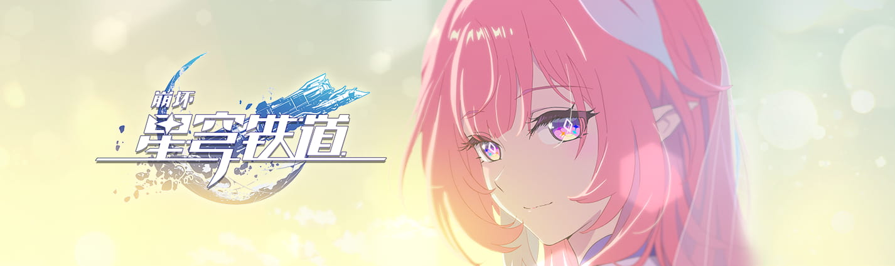

  
# Ripples_of_Past_Reverie
### 一个受《崩坏：星穹铁道》启发的“你好，世界”项目
### A "Hello World" project inspired by *Honkai: Star Rail*

所有源代码文件用UTF-8编码。  
All source files are encoded in UTF-8.  
我计划用更多编程语言实现这个项目。  
I plan to implement "Hello,World!" in more programming languages.  
并且我认为这一定是一个不同以往的浪漫故事。  
And I think it must be a different kind of romantic story than ever before.  

---

光、天空、大海、星辰、种子、花、飞鸟、希望、爱……  
这些美好的词汇，是我对世界最初的想象。  
一直以来，我用它们讲述翁发罗斯的故事。  
现在，这是最后一个，关于「明天」的故事…  
献给你的故事。  
 
Light, Sky, Sea, Stars, Seeds, Flowers, Birds, Hope, and Love  
Such words of beauty were how I first imagined the world.  
For as long as I can remember, I've used them to tell the stories of Anphoreus.  
And now, this is the last one, a story about "tomorrow",  
didicated to you.  

---

在和美丽的世界告别前，她向未来回首。  
Before bidding farewell to this beautiful world, she looks back at the future.  
 
光遍洒世间，人们在啼哭中迎来新生。  
Light bathes the world, as people welcome rebirth through their tears.  
再没有遗憾，再没有告别，他们会相逢、拥抱、成长，直至生命与银河相连。  
No more regrets, no more goodbyes. All will meet, embrace, and grow until their lives become one with the cosmos.  
 
是啊，那是「记忆」无缘亲历的来日。  
Yeah, those are the days to come that the Remembrance will never get to experience firsthand.  
但她相信，「开拓」会带着往昔，驶向永恒。  
But she believes that the Trailblaze will carry the past forward unto eternity.  
最后这一页，以全世的爱，她为因果画下「◦」——  
On this final page, with all the love in the world, she drew a "◦" for causality.  
 
如同回环的涟漪，守候在昨日的岁月。  
Like rippling waves in an endless loop, waiting in the years of yesterday.  
如同开拓的罗盘，指引明天滚滚向前。  
Like a trailblazing compass, guiding tomorrow's endless march forward.  

去bilibili看动画短片：[《崩坏：星穹铁道》动画短片：「你好，世界」](https://www.bilibili.com/video/BV14G1kB5Evp/)  
or  
watch it on YouTube: [Animated Short "Hello,World!" of Honkai: Star Rail](https://youtu.be/LB_65-rOYYo)  